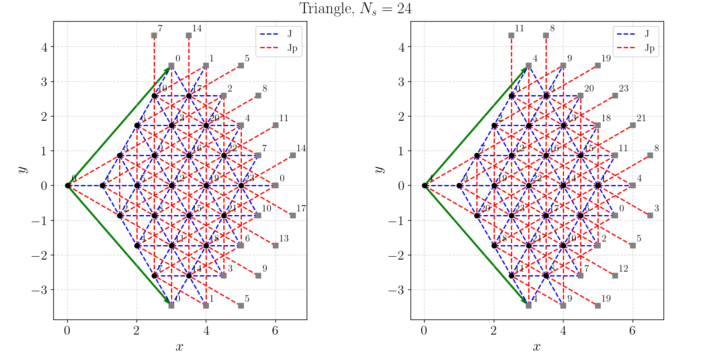

# lattice_optimizer

`lattice_optimizer` is a simple C++ simulated annealing optimizer of lattice graphs, which attemps to find a solution to the so-called *Minimum Linear Arrangement Problem*.

## Mathematical formulation

Let $`G = (V, E)`$ be a graph, where $`V = \{0, 1, ..., N-1\}`$ is the set of nodes ($`|V| = N`$) and $`E \subseteq \{ \{u, v\} | u, v \in V, u\neq v \}`$ is the set of edges, $`|E| = P`$.

Defining $`\sigma : V \rightarrow \{0, 1, ..., N-1\}`$ a numbering of G, where $`\sigma(u), \ u \in V`$ denotes the label assigned to vertex $`u\in V`$, the goal is to minimize the objective function :

$`\mathcal{C}(\sigma) := \sum_{\{ u,v \}\in E} ( 2 |\sigma(u) - \sigma(v)| - 1 ) = - P + 2 \sum_{\{ u,v \}\in E} |\sigma(u) - \sigma(v)|`$.

The optimization problem is thus: Find $`\sigma^* \in \mathcal{S}_N`$ such that:

$`\sigma^* = \text{argmin}_{\sigma \in \mathcal{S}_N} \mathcal{C}( \sigma )`$.


## Dependencies

This code relies on [nlohmann/json] for input parameter files. The single-source header of this library is located in [`src/nlohmann/`](./src/nlohmann/).

## Compilation

```
cmake -B build
cmake --build build
```

## Usage

Provide the path of the lattice graph to be optimized in the `data.json` file. Then invoke the executable as:
```
./build/main data.json
```

Note that the graph lattice file must follow a strict format, see examples.

## Usefullness

`lattice_optimizer` is invaluable for reducing the computational load when solving physical lattice systems, such as SU($N$) models where the Hamiltonian is written as a sum of permutations. Indeed, in such systems, the execution time scales linearly with $\mathcal{C}(\sigma)$.

## Examples

Several non-optimized lattices are given in [latticefiles/original](./latticefiles/original/), together with their optimized version in [latticefiles/optimized](./latticefiles/optimized/).

Below we show a triangular lattice with 24 sites (simulation torus $`\bf{t}_1 = \bf{a}_1 + 4 \bf{a}_2`$, $`\bf{t}_2 = 5\bf{a}_1 - 4\bf{a}_2`$), for a Hamiltonian having nearest (J) and next-nearest (Jp) interaction, thus 144 interaction bonds in total. The black circles show the sites of the periodic lattice, while the grey squares denote the ghost sites to unwrap the torus onto the plane. The panel on the left shows a naive numbering of sites, from left to right and bottom to top. This leads to a graph bandwidth of 23, and $`\mathcal{C}(Id) = 2088`$. The right panel shows the same lattice with a renumbering $`\sigma \in \mathcal{S}_{24}`$ of the sites obtained by simulated annealing. The graph bandwidth is now 17 and $`\mathcal{C}(\sigma) = 1784`$, thus a reduction of 15%.




## Remarks

The C++ code has been written using Claude prompting.

## License

The code is licensed under GNU GPL-v3.0 as given in the file LICENSE.

## Author

Samuel Gozel

[nlohmann/json]: <https://github.com/nlohmann/json>
